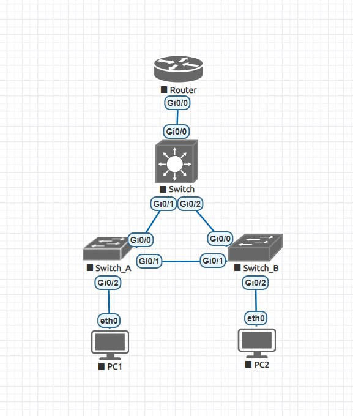
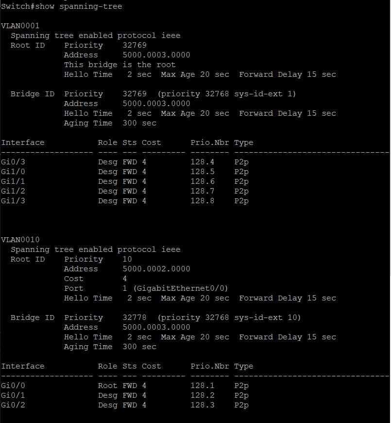
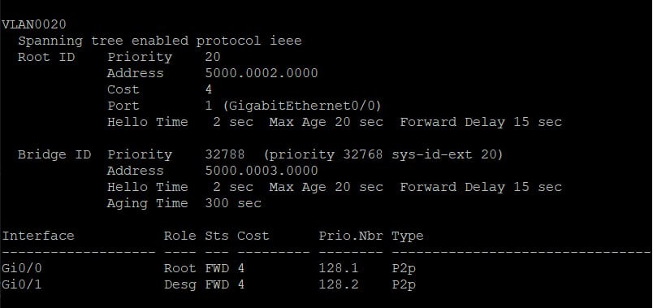
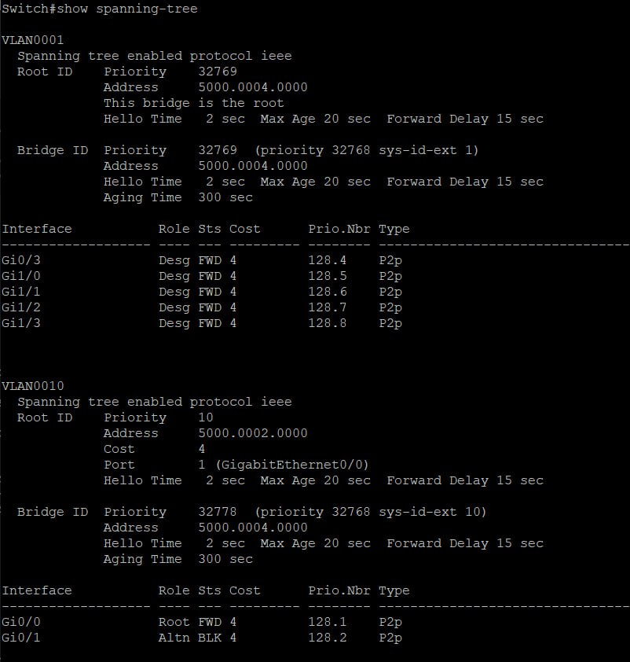
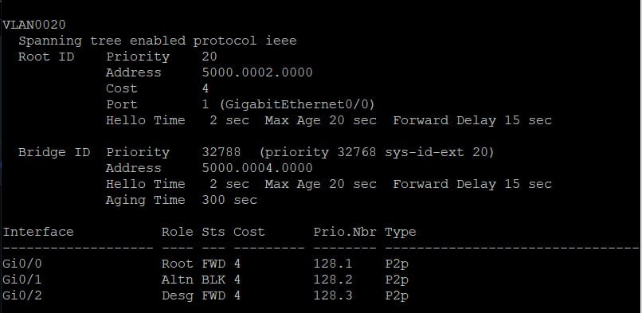

# Реализация небольшой сети офиса

Конфиги устройств лежат в директории `configs`

## Топология


## Работоспособность
Пропингуем с `PC1` `PC2` и `Router`:
```
VPCS> ping 10.0.20.1

84 bytes from 10.0.20.1 icmp_seq=1 ttl=63 time=20.507 ms
84 bytes from 10.0.20.1 icmp_seq=2 ttl=63 time=8.140 ms
84 bytes from 10.0.20.1 icmp_seq=3 ttl=63 time=10.262 ms
84 bytes from 10.0.20.1 icmp_seq=4 ttl=63 time=9.847 ms
84 bytes from 10.0.20.1 icmp_seq=5 ttl=63 time=14.533 ms

VPCS> ping 10.0.20.69

84 bytes from 10.0.20.69 icmp_seq=1 ttl=255 time=5.399 ms
84 bytes from 10.0.20.69 icmp_seq=2 ttl=255 time=5.939 ms
84 bytes from 10.0.20.69 icmp_seq=3 ttl=255 time=4.403 ms
84 bytes from 10.0.20.69 icmp_seq=4 ttl=255 time=5.813 ms
84 bytes from 10.0.20.69 icmp_seq=5 ttl=255 time=5.296 ms

VPCS> ping 10.0.10.69

84 bytes from 10.0.10.69 icmp_seq=1 ttl=255 time=10.185 ms
84 bytes from 10.0.10.69 icmp_seq=2 ttl=255 time=5.236 ms
84 bytes from 10.0.10.69 icmp_seq=3 ttl=255 time=4.641 ms
84 bytes from 10.0.10.69 icmp_seq=4 ttl=255 time=7.580 ms
84 bytes from 10.0.10.69 icmp_seq=5 ttl=255 time=5.278 ms

```

Аналогично для PC2 пропингуем PC1 и Router:
```
VPCS> ping 10.0.10.1

84 bytes from 10.0.10.1 icmp_seq=1 ttl=63 time=9.690 ms
84 bytes from 10.0.10.1 icmp_seq=2 ttl=63 time=8.269 ms
84 bytes from 10.0.10.1 icmp_seq=3 ttl=63 time=8.656 ms
84 bytes from 10.0.10.1 icmp_seq=4 ttl=63 time=10.776 ms
84 bytes from 10.0.10.1 icmp_seq=5 ttl=63 time=8.583 ms

VPCS> ping 10.0.10.69

84 bytes from 10.0.10.69 icmp_seq=1 ttl=255 time=5.411 ms
84 bytes from 10.0.10.69 icmp_seq=2 ttl=255 time=4.223 ms
84 bytes from 10.0.10.69 icmp_seq=3 ttl=255 time=5.343 ms
84 bytes from 10.0.10.69 icmp_seq=4 ttl=255 time=4.202 ms
84 bytes from 10.0.10.69 icmp_seq=5 ttl=255 time=5.345 ms

VPCS> ping 10.0.20.69

84 bytes from 10.0.20.69 icmp_seq=1 ttl=255 time=6.504 ms
84 bytes from 10.0.20.69 icmp_seq=2 ttl=255 time=4.576 ms
84 bytes from 10.0.20.69 icmp_seq=3 ttl=255 time=4.875 ms
84 bytes from 10.0.20.69 icmp_seq=4 ttl=255 time=4.663 ms
84 bytes from 10.0.20.69 icmp_seq=5 ttl=255 time=5.104 ms

```

## STP

`Switch A`:




`Switch B`:




## Отказоустойчивость

Выключий соединение между `Switch A` и `Switch B` и пропингуем с `PC1` `PC2`:

```
VPCS> ping 10.0.20.1

84 bytes from 10.0.20.1 icmp_seq=1 ttl=63 time=16.904 ms
84 bytes from 10.0.20.1 icmp_seq=2 ttl=63 time=10.127 ms
84 bytes from 10.0.20.1 icmp_seq=3 ttl=63 time=10.366 ms
84 bytes from 10.0.20.1 icmp_seq=4 ttl=63 time=7.251 ms
84 bytes from 10.0.20.1 icmp_seq=5 ttl=63 time=8.117 ms
```